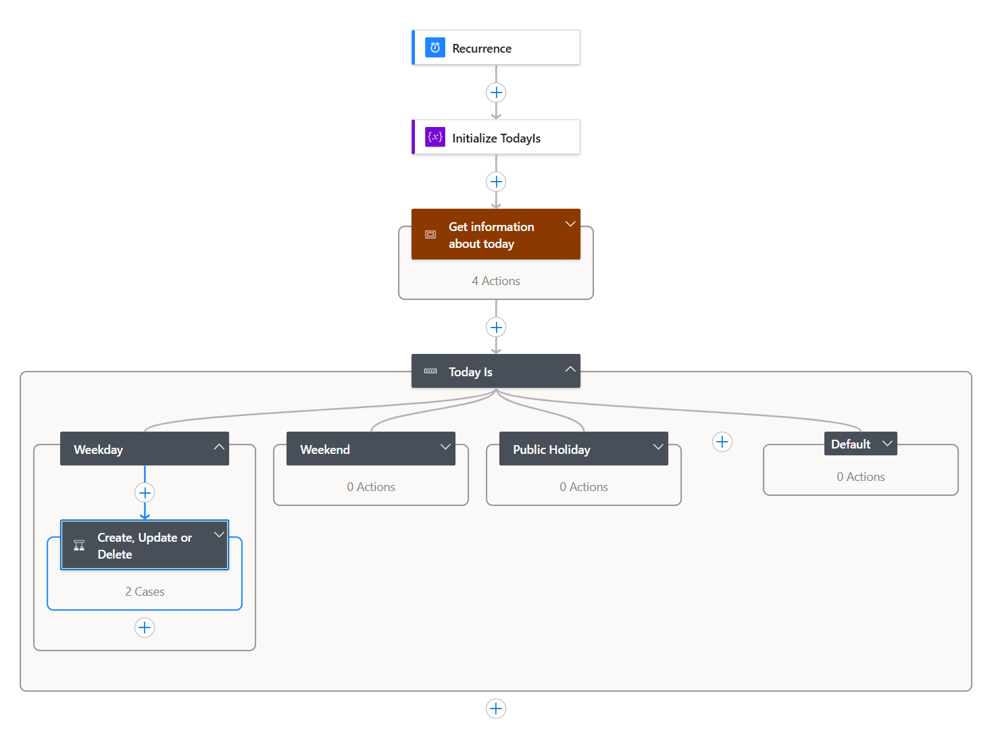
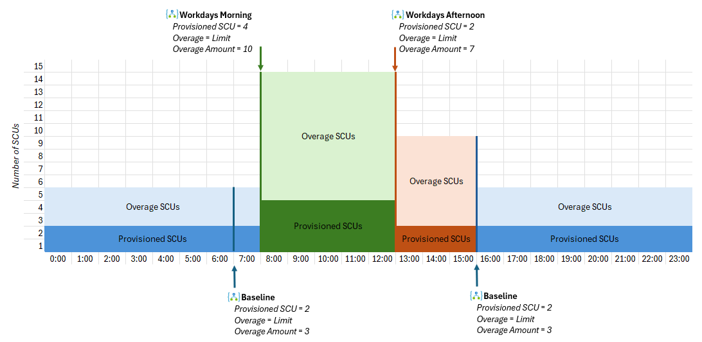

### Security Copilot - Logic App - Security Copilot Scheduler

---

## 📖 Overview

These are a set of Logic Apps you can use to schedule changes to Security Copilot capacities to meet you different usage requirements, and manage your overall Security Copilot spend.

-  **BASELINE LOGIC APP**
The Baseline Logic App can be used to set (or delete) the Security Copilot capacity based on a schedule. The defaults provided with this logic app are set to run everyday at 7AM (7:00) and 6PM (18:00) and remove the Security Copilot capacity.
>[!Note]
> I set the recurrance (or Schedule) for the Baseline app to run twice a day for my own environment this was to ensure my baseline SCU requirements was being enforced twice daily no matter what day of the week, or if it was a public holiday.

 

-  **WORKDAYS LOGIC APP**
The Workdays logic App can be used to set (or delete) the Security Copilot capacity also based on a schedule. But provides additional functionality to detect the day its running, for example you may want to use this app if you want to set specific Security Copilot capacity for weekdays, weekends or public holidays. The logic app has logic cases for each of these use cases. The defaults provided with this logic app are set to run everyday at 8AM (8:00) and create / update the Security Copilot capacity to 1 Provisioned SCU and allow upto 10 Overage SCU per hour on weekdays (excluding public holidays).

    

### Schedule Scenarios

 

> [!Tip]
> If you deployed both Logic Apps using the defaults provided, it would ensure the following:
>
> - Everyday @ 7AM it would remove the Security Copilot capacity (if it exists)
> - Weekdays (excluding Public Holidays) @ 8AM it would create the Security Copilot capacity (with 1 Provisioned SCU, and allow upto 10 overage SCU per hour)
> - Everyday @ 6PM it would remove the Security Copilot capacity (if it exists)

 

You can create different scheduling scenarios for your Security Copilot capacity using both the Baseline and Workdays logic apps if you wanted, for example:

#### Example 1:
- Deploy the Baseline Logic App, with it set to Provision 2 SCU and 3 Overage SCU that runs at 7AM and 6PM
- Deploy several copies of the Workdays Logic App
    - A Workdays Morning version, set to Provision 4 SCU and 10 Overage SCU that uses the weekday logic case to run on Weekdays (excluding Public Holidays) at 8AM
    - A Workdays Afternoon version, set to Provision 2 SCU and 7 Overage SCU that uses the weekday logic case to run on Weekdays (excluding Public Holidays at 1PM)

    

#### Example 2:
- Deploy the Baseline Logic App, with it set to Provision 2 SCU and 3 Overage SCU that runs at 7AM and 6PM
- Deploy two copies of the Workdays Logic App
    - A Workdays version, set to Provision 4 SCU and 10 Overage SCU that uses the weekday logic case to run on Weekdays (excluding Public Holidays) at 8AM
    - A Weekend version, set to Provision 1 SCU and 10 Overage SCU that uses the weekend logic case to run on Weekends (excluding Public Holidays at 1PM)
    - A Public Holiday version, set to Provision 1 SCU and 10 Overage SCU that uses the public holiday logic case to run on Weekends (excluding Public Holidays at 1PM)

 

## 💾 Installation

To install this custom plugin within your Security Copilot instance follow the below instructions:

 **BASELINE LOGIC APP**

1. **Deploy** the Baseline Logic App template to your tenant

    

2. Provide the required information to complete deployment of the template

    |Paramater|Description|
    |--------|-----------|
    |Region | The Azure Region where you will deploy the Logic App to|
    |Logic App Name | The name you want to call the Logic App in your environment|
    |Subscription ID | The Subscription ID where the Logic App and Security Copilot capacity will be deployed|
    |Resource Group | The Resource Group where the Logic App and Security Copilot capacity will be deployed|
    |Capacity Name | The Name of the Security Copilot Capacity that will be managed by the Logic App (e.g. Created, Updated or Deleted)|
    |Geography | Select from one of the valid Security Copilot geographies|
    |Location | Select the location within the chosen Security Copilot geopgrahy|
    |Cross Geography Compute | Select if you want to allow Security Copilot to process prompts outside the chosen Geography if its busy|
    |Provisioned SCU | Set the number of Provisioned SCU per hour you want.
    |Overage | Select if you want to allow / limit Overage SCUs for the Security Copilot capacity. Note you will only be charged for these if you consume more than the Provisioned SCUs in a given hour, these SCUs will be charged at 1.5x the cost of a Provisioned SCU|
    |Overage Amount | If you limit Overage set the number you want to be the limit|
    |Schedule | Update the Schedule for the Logic App|
    |Timezone | Set the Timezone that will be used by the Logic App. This is based on [Timezone IDs](https://learn.microsoft.com/en-us/previous-versions/windows/embedded/gg154758(v=winembedded.80)?redirectedfrom=MSDN)|

3. Grant the Managed Identity for the Logic App, Contributor rights on the Resource Group where you will deploy the Secuirty Copilot capacity to

    a. **Browse** to the Logic App in the Azure Portal
    
    b. **Select** Settings > Identity

    c. **Click** Azure Role Assignments

    d. **Select** + Add role assignments (Preview) from the menubar

    |Item|Description|
    |--------|-----------|
    |Scope | Resource Group|
    |Subscription | *The Subscription where you will deploy the Security Copilot capacity to*|
    |Resource Group | *The Resource Group where you will deploy the Security Copilot capacity to*|
    |Role | Contributor|

4. Enable the Logic App

    a. **Browse** to the Logic App in the Azure Portal

    b. **Click** Enable in the menubar of the overview screen

 
 

 **WORKDAYS LOGIC APP**

1. **Deploy** the Baseline Logic App template to your tenant

    

2. Provide the required information to complete deployment of the template

    |Paramater|Description|
    |--------|-----------|
    |Region | The Azure Region where you will deploy the Logic App to|
    |Logic App Name | The name you want to call the Logic App in your environment|
    |Subscription ID | The Subscription ID where the Logic App and Security Copilot capacity will be deployed|
    |Resource Group | The Resource Group where the Logic App and Security Copilot capacity will be deployed|
    |Capacity Name | The Name of the Security Copilot Capacity that will be managed by the Logic App (e.g. Created, Updated or Deleted)|
    |Geography | Select from one of the valid Security Copilot geographies|
    |Location | Select the location within the chosen Security Copilot geopgrahy|
    |Cross Geography Compute | Select if you want to allow Security Copilot to process prompts outside the chosen Geography if its busy|
    |Provisioned SCU | Set the number of Provisioned SCU per hour you want.
    |Overage | Select if you want to allow / limit Overage SCUs for the Security Copilot capacity. Note you will only be charged for these if you consume more than the Provisioned SCUs in a given hour, these SCUs will be charged at 1.5x the cost of a Provisioned SCU|
    |Overage Amount | If you limit Overage set the number you want to be the limit|
    |Public Holiday Country Code | Set the Country Code to check for Public Holidays. A valid country code such as GB and UA|
    |Schedule | Update the Schedule for the Logic App|
    |Timezone | Set the Timezone that will be used by the Logic App. This is based on [Timezone IDs](https://learn.microsoft.com/en-us/previous-versions/windows/embedded/gg154758(v=winembedded.80)?redirectedfrom=MSDN)|

3. Grant the Managed Identity for the Logic App, Contributor rights on the Resource Group where you will deploy the Secuirty Copilot capacity to

    a. **Browse** to the Logic App in the Azure Portal
    
    b. **Select** Settings > Identity

    c. **Click** Azure Role Assignments

    d. **Select** + Add role assignments (Preview) from the menubar

    |Item|Description|
    |--------|-----------|
    |Scope | Resource Group|
    |Subscription | *The Subscription where you will deploy the Security Copilot capacity to*|
    |Resource Group | *The Resource Group where you will deploy the Security Copilot capacity to*|
    |Role | Contributor|

4. **Edit** the Logic App using the Design to meet your requirements.

5. **Enable** the Logic App

    a. **Browse** to the Logic App in the Azure Portal

    b. **Click** Enable in the menubar of the overview screen

 

## 🙌 Acknowledgements

This Logic App is a fork of the amazing work done by [stefanpems](https://github.com/stefanpems), and has been adapted / extended to fit my own requirements. Make sure to check out more of [stefanpems](https://github.com/stefanpems) work, including:

- [LinkedIn Posts](https://www.linkedin.com/in/stefanopescosolido/)
- [Stefanpe's Blog](https://stefanpems.github.io/)
