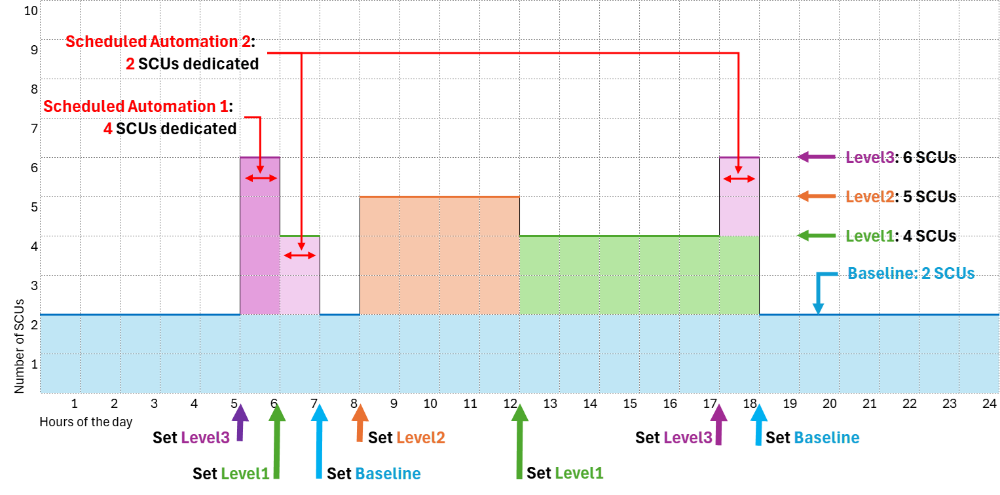

# Azure Logic App ARM Template for scheduling Copilot for Security SCU provisioning. 

The file template.json is an ARM template for creating an Azure Logic App that is capable of automatically changing the capacity (SCUs) of Copilot for Security based on the time of the day and wheater the day is a workday, weekend of national holiday.

### Prerequisites:
* Credit in Azure for consuming SCUs

### Description 
This Logic App sets the specified number of Security Compute Units (SCUs) for Security Copilot, but only if the current day is a working day. The number of desired SCUs is specified in the Logic App parameters. If the capacity already exists, the Logic App modifies its capacity - again, only during working days - according to the number of SCUs specified as a parameter. If the specified number of SCUs is zero, the Logic App deletes the capacity regardless of the day. Working days are defined by excluding non-working weekdays and listing national and local holidays.

### Instructions: 
1. Deploy the template with the deployment button below
1. Assign to the Managed Identity of the Logic App the Contributor role on the Resource Group where the Capacity has to be created or modified or deleted.
2. Set the desired time for the execution recurrence in the Logic App trigger (tipically every day at specified hours)
3. Set the Logic App paramters (list of national and local holidays, SCUs number, capacity name and resource group, etc...)
5. Enable the Logic App

### Deployment button

### Additional Instructions: 
Once correctly configured, clone the Logic App (use the 'Clone' button on the Overview page of the Logic App) to create additional instances, scheduled at different times of the day, that set a different number of SCUs. 
For example - just an extremely complex scenario, to better explain the concepts! -, in a working day your company may want to have these instances of this Logic App:
* One instance, named "Baseline", firing at 7 am and 6 pm that set 2 SCUs
* A second instance (a clone of the baseline), named "Level 1", firing at 6 am and 12 pm, that set 4 SCUs
* A third instance (another clone of the baseline), named "Level 2", firing at 8 am, that set 5 SCUs
* A fourth instance (another clone of the baseline), named "Level 3", firing at 5 am and 5 pm, that set 6 SCUs

NOTE: you can create additional instances of this Logic App also by redeploying the template published in this page. However, we recommend "cloning" already deployed Logic Apps to minimize the setup steps and to reduce the possibilities of errors (e.g. using different names for the capacity to be created or modified or deleted). The cloned Logic App already has most of the parameters correctly set; you only need to authorize its Managed Identity on the Resource Group where the capacity has to be created / modified / deleted, set the recurrence, and specify the desired number of SCUs.
When cloning a Logic App, it is always advisable to set it initially to disabled to avoid the very first run which, anyway, will fail before assigning the permissions to the new Managed Identity.

### Additional resources
The following article contains a detailed description of how the Logic App works. It also contains setup instructions that are no longer accurate because most of the actions described are now automated during the template deployment:
[Scheduling the Provisioning of Capacity (SCUs) for Copilot for Security - Logic App Template](https://www.linkedin.com/pulse/scheduling-provisioning-capacity-scus-copilot-logic-pescosolido-ku8ef/?trackingId=vhZAZBr9Snqoj%2FkSaFdqJQ%3D%3D)
